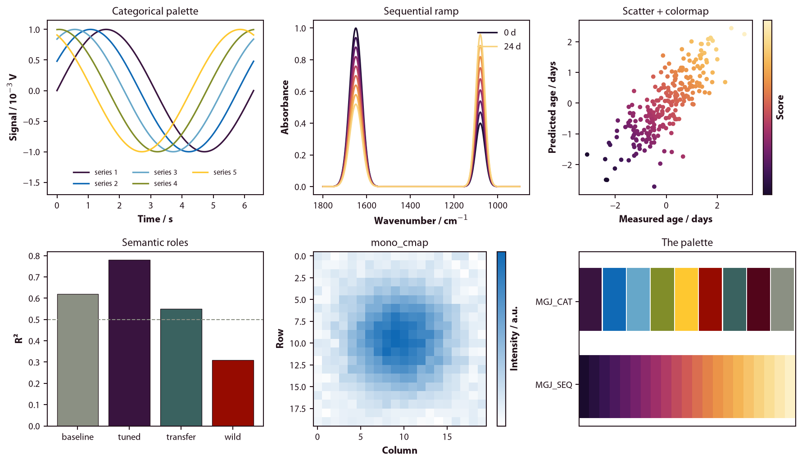

# mgjstyle

My colour palette and figure style for matplotlib. The
same one used in Igor Pro, so figures look identical whichever
tool made them.



## Install

```bash
pip install git+https://github.com/magonji/mgjstyle.git
```

or, working on it locally:

```bash
git clone https://github.com/magonji/mgjstyle.git
cd mgjstyle
pip install -e ".[dev]"
```

## Use

```python
import matplotlib.pyplot as plt
import mgjstyle as mgj

mgj.use()                                   # fonts + colormaps + rcParams

fig, ax = plt.subplots()
ax.plot(wavenumber, absorbance, color=mgj.PRIMARY)
ax.set_xlabel(mgj.qlabel("Wavenumber", "cm^-1"))   # -> Wavenumber / cm⁻¹
ax.set_ylabel(mgj.qlabel("Absorbance"))
mgj.finish(ax)                              # enforce the box, per axes
fig.savefig("figure.png")
```

For one block only, without touching the global state:

```python
with mgj.context():
    fig, ax = plt.subplots()
```

## The house rules

`mgj.use()` sets all of this; the point of each rule is worth knowing.

| Rule | Why |
|---|---|
| Full **box** — four spines, top and right as mirror axes with no ticks and no labels | The data area is bounded, so values can be read off against the far edge |
| **No grid** | Grid lines compete with data |
| Font **Myriad**, falling back gracefully | House font; see below |
| Axis **labels bold**, tick numbers normal | The label is what you read first |
| Units **after a slash**: `Age / days` | The plotted numbers *are* the quantity divided by its unit |
| Ticks pointing **out** | They never overlap a data point |
| Legend **without a frame** | One less box |

`mgj.finish(ax)` re-applies the box and kills the grid on a single axes. Use it
whenever the plot was drawn by code that ignores your rcParams — seaborn,
`df.plot()`, twin axes, insets. `mgj.finish_fig(fig)` does the whole figure.

### Axis labels

```python
mgj.qlabel("Absorbance")               # 'Absorbance'          (dimensionless)
mgj.qlabel("Age", "days")              # 'Age / days'
mgj.qlabel("Wavenumber", "cm^-1")      # 'Wavenumber / cm⁻¹'
mgj.qlabel("Age", "days", "10^3")      # 'Age / 10³ days'
```

Caret exponents become real superscripts via mathtext, which renders in any
font — Myriad itself has no unicode superscript-minus glyph.

## The palette

**`MGJ_CAT` — 9 categorical colours.** For series that are different *kinds* of
thing: species, treatments, models. Applied as the default property cycle.

| | | | | | | | | |
|---|---|---|---|---|---|---|---|---|
| `#39143F` | `#0F69B5` | `#66A7C9` | `#818D29` | `#FEC830` | `#960B00` | `#3A6260` | `#52051A` | `#8B9083` |

**`MGJ_SEQ` — a 21-step ramp**, dark plum → orange → cream. For quantities that
are *ordered*: age, dose, time, intensity. Registered as the colormap
`'MGJ_Seq'` (and `'MGJ_Seq_r'`), and set as `image.cmap`.

```python
mgj.categorical(4)              # first 4 categorical colours (cycles past 9)
mgj.sequential(6)               # 6 colours spread along the ramp
mgj.sequential(6, hi=0.85)      # ... skipping the palest end, better on white
mgj.mono_cmap(mgj.PRIMARY)      # white -> one colour, for single-hue heatmaps
plt.imshow(z, cmap="MGJ_Seq")
```

Named roles, so a figure's meaning survives a palette change:

```python
mgj.PRIMARY   # #0F69B5  default accent — one series, one colour
mgj.DEEP      # #39143F  emphasis: the highlighted / winning case
mgj.POS       # #3A6260  good, improvement
mgj.NEG       # #960B00  bad, loss
mgj.GOLD      # #FEC830  attention, annotation
mgj.MUTED     # #8B9083  context, reference lines
mgj.INK       # #201018  text and axes
```

Coming from Igor? `mgj.color_traces(ax)` and `mgj.ramp_traces(ax)` are the
twins of `MGJ_ColorTraces` and `MGJ_RampTraces` — they recolour lines that are
already drawn. The original procedure file is kept in
[`igor/MGJcolors.ipf`](igor/MGJcolors.ipf).

## Fonts

The house font is **Myriad Pro**. It ships with Adobe applications, so many
machines will not have it, and matplotlib does not index Adobe's OTFs even
where it is installed. `mgj.use()` therefore searches the usual font
directories for it, and otherwise walks down a fallback stack of humanist sans
faces — Source Sans 3, Avenir, Open Sans, Lato, PT Sans, Helvetica Neue, Arial
— ending at DejaVu Sans, which ships with matplotlib. **Figures always render;
they just look their best where Myriad exists.**

```python
mgj.resolved_font()     # which face you actually got
mgj.has_myriad()        # False on most machines
mgj.use(warn_font=True) # say so, once, at the start of a script
mgj.add_font_dir("~/fonts/myriad")   # fonts kept somewhere unusual
```

Closest free substitute: [Source Sans 3](https://github.com/adobe-fonts/source-sans/releases)
— download, install as usual, then delete matplotlib's font cache
(`rm -rf ~/.matplotlib/fontlist-*.json`) so it gets noticed.

## Without importing the package

```python
import mgjstyle, matplotlib.pyplot as plt
mgjstyle.install_mplstyle()     # once, copies into matplotlib's config dir
plt.style.use("mgj")            # then anywhere, e.g. in a notebook
```

`mgj.use()` remains the complete option — a `.mplstyle` file cannot register
colormaps or hunt for Myriad on disk.

## Tweaks

```python
mgj.use(font_size=13, linewidth=1.2, dpi=300)   # posters, print
mgj.rc_params()                                  # the settings as a plain dict
```

## Tests

```bash
pytest
```

## Licence

MIT — see [LICENSE](LICENSE). Use it, fork it, change the colours.
